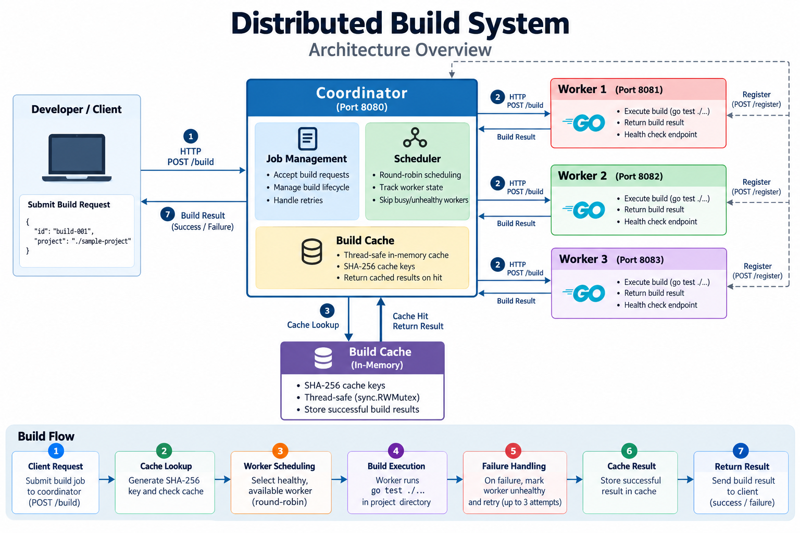
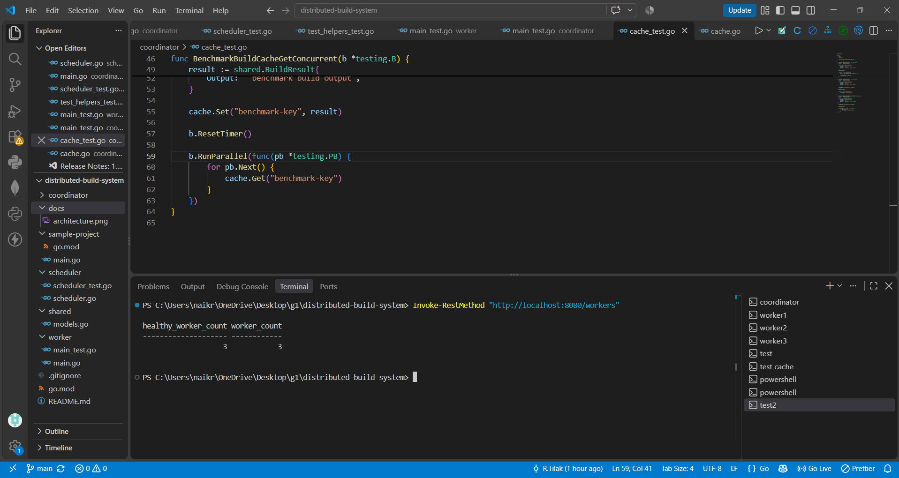
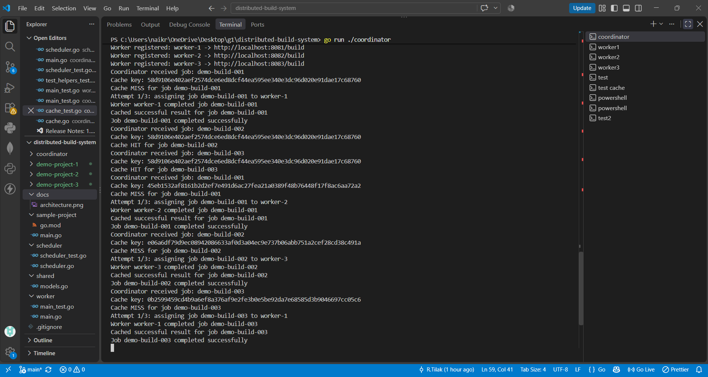
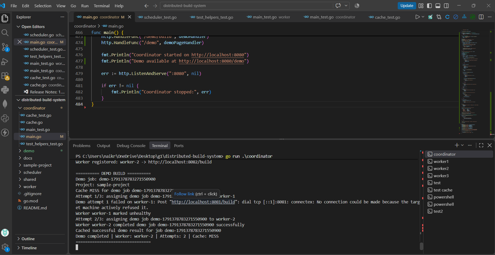

<div align="center">

# Distributed Build System

### Fault-tolerant distributed build execution platform built with Go

A distributed system that schedules build jobs across multiple workers,
caches successful builds, detects worker failures, and automatically
retries failed jobs on healthy workers.

<br>


</div>

---

## Overview

**Distributed Build System** separates build orchestration from build
execution.

A central **Coordinator** receives build requests and delegates them to
a pool of independent **Workers** through a health-aware **Scheduler**.

The system also includes:

- Thread-safe build caching
- SHA-256 cache keys
- Round-robin scheduling
- Worker health tracking
- Automatic retry and failover
- Request timeouts
- Concurrent request handling
- Automated tests
- Performance benchmarks

The goal is to demonstrate practical distributed-systems concepts using
Go rather than building another CRUD application.

---

## Architecture

<p align="center">
  
</p>

### Request Flow

```text
Developer / Client
       │
       │ HTTP
       ▼
┌─────────────────┐
│   Coordinator   │
│                 │
│ Job Management  │
│ Cache           │
│ Retry Logic     │
└────────┬────────┘
         │
         ▼
┌─────────────────┐
│    Scheduler    │
│                 │
│ Round Robin     │
│ Worker State    │
│ Health Tracking │
└────────┬────────┘
         │
    ┌────┼────┐
    │    │    │
    ▼    ▼    ▼
 Worker Worker Worker
   1      2      3
    │    │    │
    └────┼────┘
         │
         ▼
   Build Execution
```
---
## Demo
### Worker Pool
Three independent workers register with the Coordinator and become
available for build execution.
<p align="center">
  
</p>

### Scheduling & Caching
Build requests are distributed across workers using round-robin
scheduling.
Successful builds are cached so repeated requests for the same project
can return immediately without another worker execution.
<p align="center">
  
</p>

### Failure Recovery
When a worker becomes unavailable, the Coordinator detects the failed
request, marks the worker unhealthy, retries the build, and routes the
job to another healthy worker.
<p align="center">
  
</p>

## Core Components
Component	Responsibility
Coordinator	Receives build requests and orchestrates execution
Scheduler	Selects available healthy workers
Worker	Executes the actual build
Build Cache	Stores successful build results
Shared Models	Defines communication structures between components


## Key Features
### Distributed Build Execution
Build jobs are executed by independent worker processes instead of
running directly inside the Coordinator.
Round-Robin Scheduling
The Scheduler distributes jobs across workers while tracking their
current availability.
Job 1 ──► Worker 1
Job 2 ──► Worker 2
Job 3 ──► Worker 3
Job 4 ──► Worker 1

### Thread-Safe Build Cache
The Coordinator uses an in-memory cache protected by sync.RWMutex.
Build Request
      │
      ▼
 Cache Lookup
    /     \
  HIT     MISS
   │        │
   ▼        ▼
Result   Scheduler
            │
            ▼
          Worker

### SHA-256 Cache Keys
Cache keys are generated using SHA-256 from the project input, allowing
different job IDs for the same project to reuse cached results.
Worker Health Tracking
Workers maintain:
- ID
- Address
- Busy state
- Health state
Unhealthy workers are excluded from scheduling.
Automatic Retry & Failover
Failed worker requests trigger retry attempts.
Worker 1
   │
   X Failure
   │
   ▼
Mark Unhealthy
   │
   ▼
Retry
   │
   ▼
Worker 2
   │
   ▼
Success

The Coordinator supports up to 3 build attempts.
Request Timeout
Worker build requests use a 30-second HTTP timeout to prevent
requests from remaining blocked indefinitely.
API
Coordinator
Method	Endpoint	Purpose
POST	/register	Register a worker
POST	/build	Submit a build
GET	/health	Coordinator health
GET	/workers	Worker status
GET	/cache	Cache statistics


Worker
Method	Endpoint	Purpose
POST	/build	Execute a build
GET	/health	Worker health


Quick Start
Requirements
- Go 1.27+
- Windows, Linux, or macOS
Clone
git clone https://github.com/RTilak07/distributed-build-system.git
cd distributed-build-system

Start Coordinator
go run ./coordinator

Coordinator:
http://localhost:8080

Start Worker 1
go run ./worker -id worker-1 -port 8081

Start Worker 2
go run ./worker -id worker-2 -port 8082

Start Worker 3
go run ./worker -id worker-3 -port 8083

Workers automatically register with the Coordinator.
Submit a Build
PowerShell:
Invoke-RestMethod `
  -Uri "http://localhost:8080/build" `
  -Method Post `
  -ContentType "application/json" `
  -Body '{"id":"build-001","project":"./sample-project"}'

Example response:
{
  "job_id": "build-001",
  "success": true,
  "output": "..."
}

Monitor Workers
Invoke-RestMethod "http://localhost:8080/workers"

Example:
{
  "worker_count": 3,
  "healthy_worker_count": 3
}

Monitor Cache
Invoke-RestMethod "http://localhost:8080/cache"

Example:
{
  "cache_entries": 1
}

## Testing
Run the complete test suite:
go test ./...

The project includes tests for:
- Worker registration
- Invalid requests
- Health endpoints
- Round-robin scheduling
- Busy-worker handling
- Unhealthy-worker handling
- Worker recovery
- Cache behavior
- Coordinator endpoints
- Worker build execution
Performance
The build cache was benchmarked using Go's built-in benchmarking
framework.
Test Environment
OS:   Windows
Arch: amd64
CPU:  11th Gen Intel Core i5-11260H @ 2.60GHz

Results
Operation	Performance	Allocations
Cache Set	471.6 ns/op	285 B/op
Cache Get	23.71 ns/op	0 B/op
Concurrent Cache Get	42.83 ns/op	0 B/op


Benchmark command:
go test ./coordinator -run '^$' -bench 'BenchmarkBuildCache' -benchmem

The concurrent benchmark uses Go's parallel benchmark execution to
measure cache reads under concurrent access.
Reliability Model
                    Build Request
                         │
                         ▼
                   Cache Lookup
                    /       \
                  HIT       MISS
                   │          │
                   ▼          ▼
              Return     Scheduler
              Result         │
                             ▼
                       Healthy Worker
                         /       \
                    Success     Failure
                       │           │
                       ▼           ▼
                  Cache Result  Mark Unhealthy
                                   │
                                   ▼
                                  Retry
                                   │
                                   ▼
                           Another Worker
                                   │
                                   ▼
                                Success

## Project Structure
distributed-build-system/
│
├── coordinator/
│   ├── main.go
│   ├── cache.go
│   ├── main_test.go
│   ├── cache_test.go
│   └── test_helpers_test.go
│
├── scheduler/
│   ├── scheduler.go
│   └── scheduler_test.go
│
├── worker/
│   ├── main.go
│   └── main_test.go
│
├── shared/
│   └── models.go
│
├── sample-project/
│   ├── go.mod
│   └── main.go
│
├── docs/
│   ├── architecture.png
│   └── screenshots/
│       ├── worker-health.png
│       ├── scheduling-cache.png
│       └── failover.png
│
├── .gitignore
├── README.md
└── go.mod

## Engineering Decisions
Why Go?
Go provides lightweight concurrency, strong standard-library HTTP
support, fast compilation, and straightforward deployment.
Why In-Memory Cache?
The current implementation intentionally keeps the cache local to the
Coordinator to demonstrate concurrency control without introducing
unnecessary infrastructure.
A production version could use Redis or another distributed cache when
multiple Coordinator instances need shared state.
Why Round-Robin?
Round-robin provides predictable worker distribution while keeping the
scheduler simple.
The implementation extends this with worker availability and health
tracking.
Why HTTP + JSON?
HTTP keeps the Coordinator and Workers independently deployable and
makes the communication protocol easy to inspect and test.
Future Improvements
Potential production-level improvements include:
- Persistent distributed cache
- Containerized build isolation
- Persistent job queue
- Worker heartbeat mechanism
- Dynamic worker discovery
- Authentication and authorization
- Build artifact storage
- Distributed Coordinator instances
- Metrics and observability
- Job cancellation
- Resource limits for build execution
Technology Stack
<p align="center">

Go · HTTP · JSON · Concurrency · SHA-256 · RWMutex · Testing · Benchmarking
</p>

Author
<div align="center">

R Tilak
Computer Science Engineering
GitHub
</div>
```